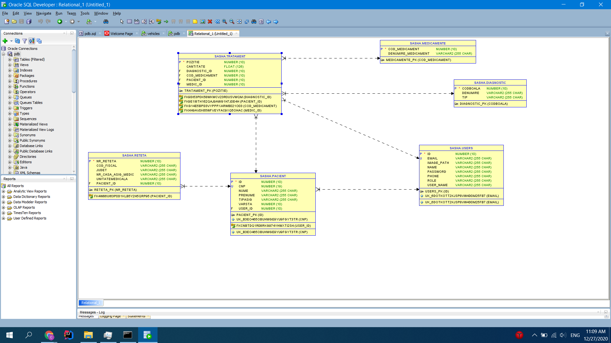
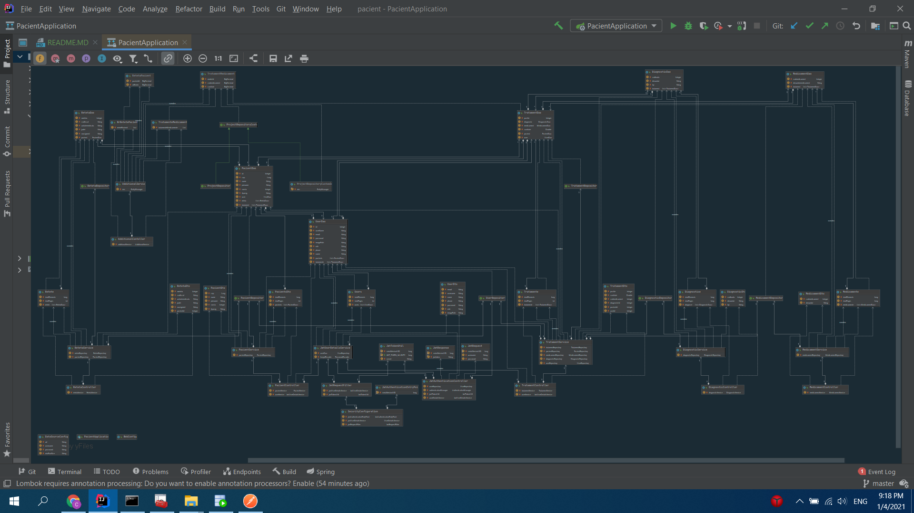

**CRUD APP FOR PATIENTS MANAGEMENT**

This app is a university project to show the work of REST API application with oracle DB.

For Client was used:
* React (the latest version with hooks and functional paradigm)
* Redux (for state-management)
* Thunk (for async actions with redux)
* Material-UI (The Main View library)
* Axios (for API requests on the client(authorized with JWT TOKEN))
* React-Router (for navigation purpose)

For Server was used:
* Spring-Boot (API Framework based on Spring)
* JDBC (for connection with DataBase(MySql))
* Spring-Security-**JWT** (for users authentication and users management)
* Hibernate (for work with DataBase using Classes)

For DataBase was used OracleDB 19.c

To run this app you should have the following requirements:
* Maven (https://maven.apache.org/install.html)
* yarn (https://classic.yarnpkg.com/en/docs/install/#windows-stable)
* Oracle DB (at least 12c) (https://www.oracle.com/database/technologies/)

To run this app:
* git clone https://github.com/CristiCeban/Pacient
* import db schema(pacient.sql) from the cloned repository in your pc (I used sqlDeveloper 19.2.1) 
* change the following file server/src/main/resources/application.properties
    1) ```spring.datasource.url=jdbc:oracle:thin:@//localhost:1521/pdb``` - **1521 to your db port** and **pdb to imported db name**
    2) ```spring.datasource.username=sasha``` -  **sasha to your db userName**
    3) ```spring.datasource.password=sanea``` - **sanea to your db password**
* open 2 terminals in the cloned repository
1) * ```mvn spring-boot:run``` (this will install all dependencies for the server from maven,this can last for ~ 5 minutes,in dependency of internet connection and the power of the pc,and then this will start the server)
2) 
    * ```cd client ```
    * ```yarn install``` (this will install all dependencies for the client from yarn)
    * ```yarn start``` (this will run the app in the browser)

By default
* Server have default port **8080**
* Client have default port **3000**
* If some of them is occupied
    1) ```netstat -ano | findstr :occupied_port``` (this will find the pid which is using the occupied port)
    2) ```taskkill /PID pid_from_above /F```
* Rerun the app

Also, you can check endpoints of server using the postman Collection from postman.txt

users:
1) * pacient@mail.com
   * password
2) * medic@mail.com
   * I forgot it (((

Here you can find diagram of BD tables and their relations.


**ABOUT APP**
This app allows you to manage a database of patients,their recipe,pills, and so on.
Each registered user is the doctor,so then user add a new treatment for user, it will be their doctor for this ill.

this piece of code from src/main/resources/application.properties allows managing connection with oracle db

```properties
spring.jpa.database-platform=org.hibernate.dialect.Oracle12cDialect
spring.jpa.hibernate.use-new-id-generator-mappings=false
spring.jpa.hibernate.ddl-auto=update

spring.datasource.url=jdbc:oracle:thin:@//localhost:1521/pdb
spring.datasource.username=sasha
spring.datasource.password=sanea
spring.datasource.driver-class-name=oracle.jdbc.OracleDriver
```

For working with DB I used Hibernate approach
https://www.baeldung.com/spring-boot-hibernate

Also for more complex query I am using custom query's data repository

```java
public class ProjectRepositoryCustomImp implements ProjectRepositoryCustom {


    private final EntityManager em;

    ProjectRepositoryCustomImp(EntityManager em) {
        this.em = em;
    }

    @Override
    public TratamentMedicament getMedicamentToMedic() {
        String queryString = "select medic_id,cod_medicament,sum(cantitate) as cantitati from tratament  GROUP BY ROLLUP(medic_id,cod_medicament)";
        try {
            Query query = em.createNativeQuery(queryString, "MedicinePerDoctor");

            return (TratamentMedicament) query.getResultList();
        } catch (Exception e) {
            e.printStackTrace();
        }

        return null;
    }
}
```

A preview of uml (For full UML check PacientApplication.uml)


for demo video of app you can check
https://www.youtube.com/watch?v=vo0OMQhLpag&feature=youtu.be

**Conclusion:**
Oracle DB Works fine with spring boot, and it can be useful for small and big app,but for a small app I would choose something easier.
But for big it's a must-have.
